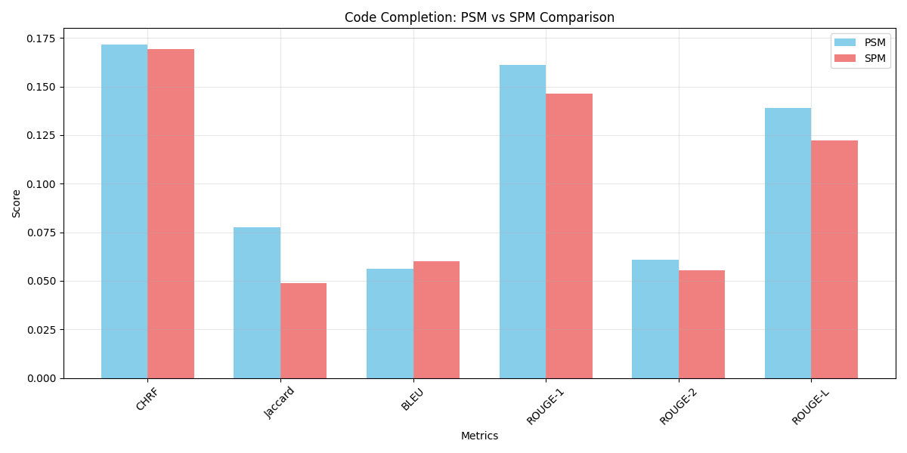
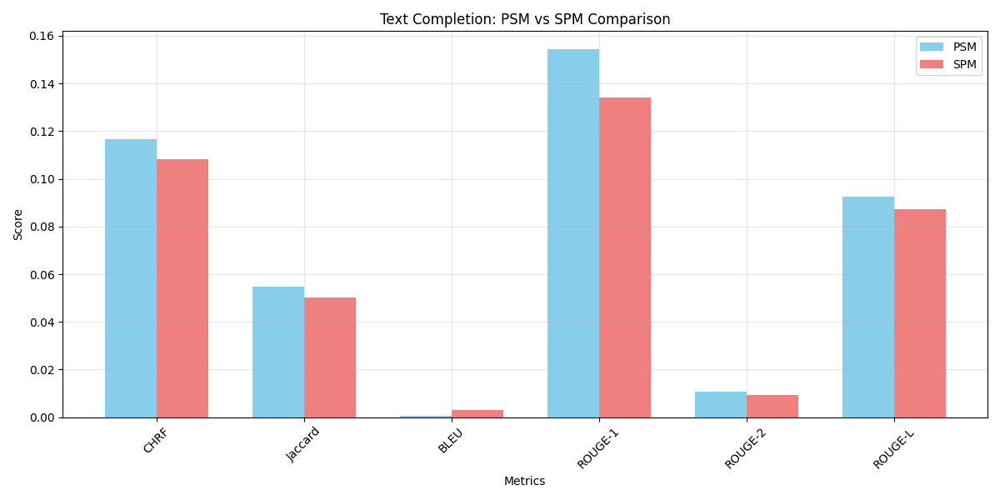
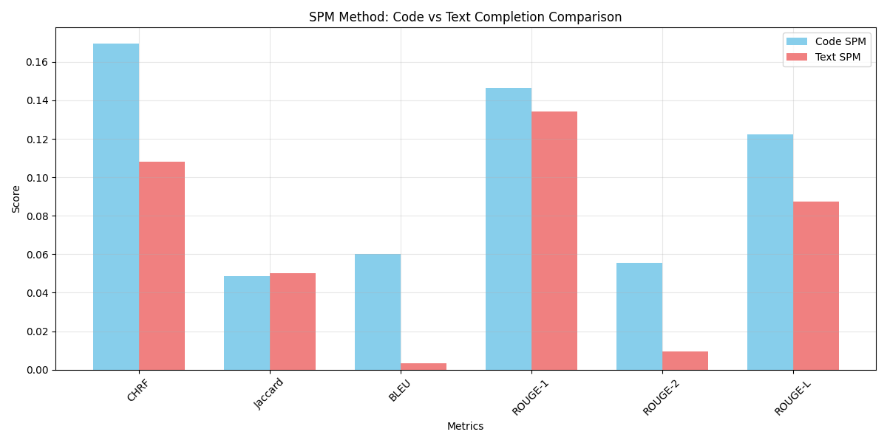

# Evaluation of LLM predictions on FIM datasets using popular metrics

*This repository was created for Jetbrains 2025 Internship programm*

## Description 
With the help of TinyStarCoder we investigate its' prediction capabilities on natural language and code-based datasets.
First we perform different FiM (Fill-in-the-Middle) techniques - SPM and PSM to create code completion datasets.
Each dataset will contain records in format:
- <fim_prefix>{prefix}<fim_suffix>{suffix}<fim_middle>{middle} - PSM
- <fim_suffix>{suffix}<fim_prefix>{prefix}<fim_middle>{middle} - SMP
 
Then we prompt the model and wait for the predictions.
As we receive the predictions, we calculate metrics popularly used in code completion: 
- CHARF, 
- Jaccard, 
- BLEU, 
- ROUGE, 
- Exact Macth  
 
Based on results we evaluate metrics and compare the results of SMP and PSM methods as well as difference between natural language and code-based datasets.
 
## Research paper
You can find it under: *FIM_Investigation.pdf* file in main folder tree

## How to generate datasets
`make dataset-code mode="PSM"` 
or  
`make dataset-text mode="SMP"`

## How to generate completions
`make predict-code` 
or  
`make predict-text` 

## How to generate charts
`make charts` 

## Results visualizations

*Code completion using PSM and SPM method - code based dataset*
 
 

*Natural language Completion using PSM and SPM method - text based dataset*
 
 

*SPM method: Code vs Natural language completion comparison*

